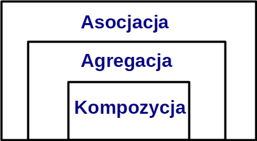
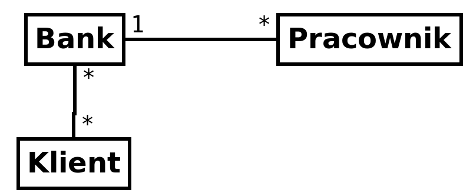
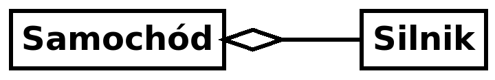
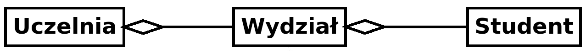
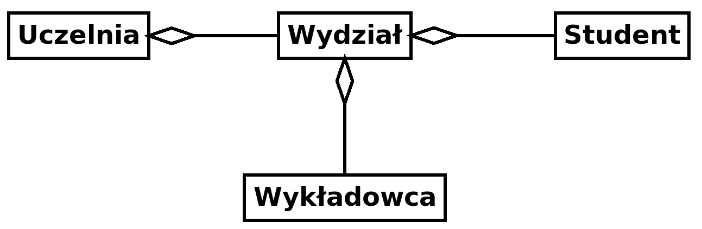
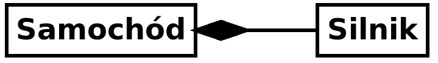
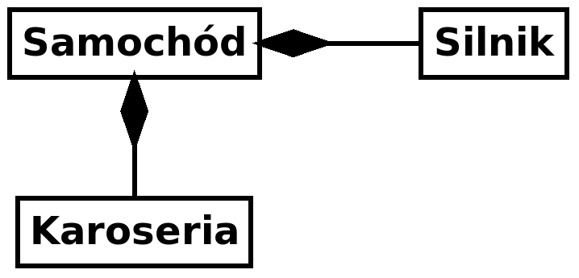
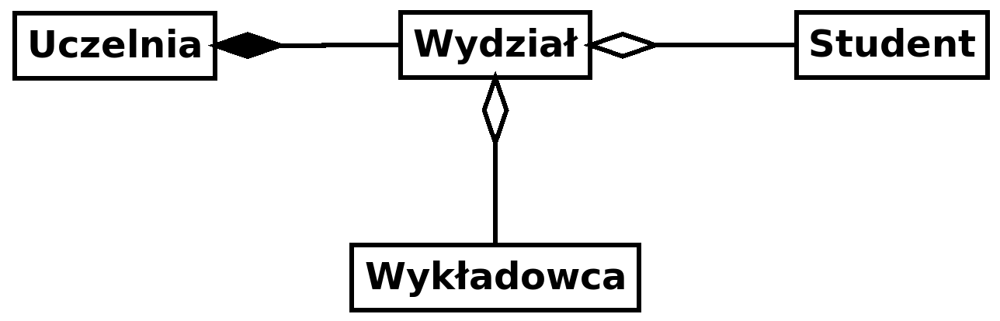
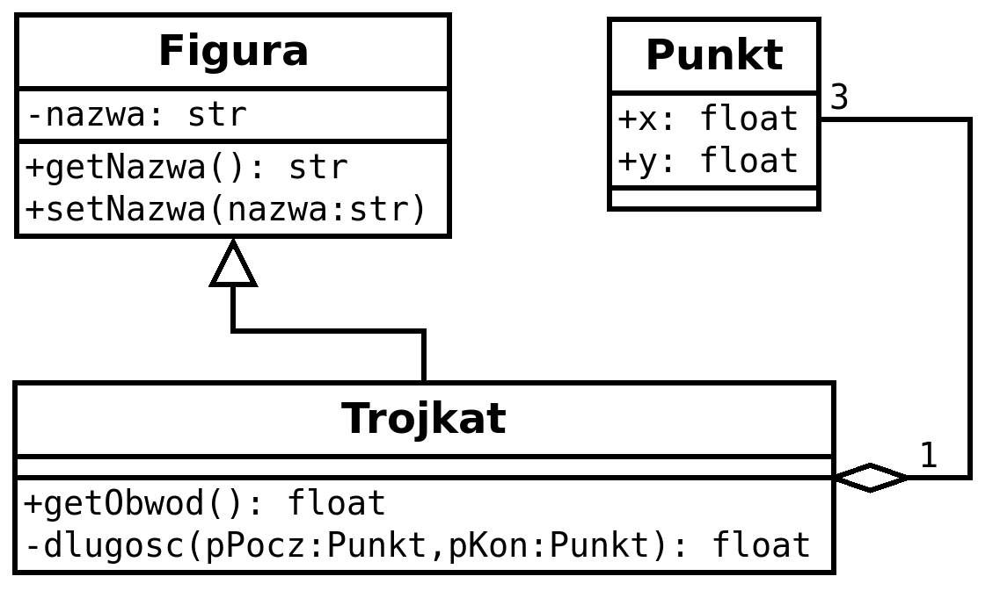

# Programowanie obiektowe w Python - zajęcia 4

**Rozwiązanie zadania 12**

Pod koniec poprzednich zajęć należało zmodyfikować klasę *Osoba*, korzystając z jej pierwszej wersji. Kroki zadania były następujące:<br>
a) Dodaj metodę, dzięki której będzie możliwe utworzenie osoby z wartościami domyślnymi.<br>
b) Dodaj metodę, dzięki której będzie możliwe utworzenie osoby z przypisanym dodatkowym atrybutem *stanowisko*. Usprawnij metodę *przedstawSie()* aby obsługiwała odpowiednio dwa rodzaje komunikatów - dla osoby ze stanowiskiem i bez.<br>
c) Dodaj metodę, dzięki której można będzie utworzyć domyślną osobę z przypisanym domyślnym stanowiskiem.<br>

Kod do wykorzystania (pierwotna wersja klasy *Osoba*):

```python
class Osoba:
    def __init__(self,imie,nazwisko,wiek):
        self.imie=imie
        self.nazwisko=nazwisko
        self.wiek=wiek
    def przedstawSie(self):
        print(f"Nazywam się {self.imie} {self.nazwisko}, mam lat {self.wiek}") 
```

Rozwiązanie:

```python
class Osoba:
    def __init__(self,imie,nazwisko,wiek):
        self.imie=imie
        self.nazwisko=nazwisko
        self.wiek=wiek
        self.stanowisko="brak"
    @classmethod    
    def zatrudniona(cls,imie,nazwisko,wiek,stanowisko):
        osoba=cls(imie,nazwisko,wiek)
        osoba.stanowisko=stanowisko
        return osoba
    @classmethod    
    def domyslna(cls):
        return cls("Jan","Kowalski",33)
    @classmethod
    def domyslna_zatr(cls):
        return cls.zatrudniona("Jan","Kowalski",33,"Kierownik")    
    def przedstawSie(self):
        if self.stanowisko=="brak":
            print(f"Nazywam się {self.imie} {self.nazwisko}, mam lat {self.wiek}") 
        else:
            print(f"Nazywam się {self.imie} {self.nazwisko}, mam lat {self.wiek} i pracuję jako {self.stanowisko}")
```
## Asocjacja, agregacja, kompozycja ##
**Asocjacja** jest relacją pomiędzy dwiema oddzielnymi klasami, która może być realizowana za pośrednictwem ich obiektów (instancji). Asocjacja może być określona ilościowo jako: jeden-do-jeden, jeden-do-wiele, wiele-do-wiele. W programowaniu obiektowym, obiekt komunikuje się z innym obiektem aby korzystać z funkcjonalności i usług dostarczaneych przez ten obiekt. **Kompozycja** i **agregacja** to dwa przypadki asocjacji.<br>
Asocjacja reprezentuje związek, w którym oba obiekty istnieją niezależne od siebie, tzn. istnienie jednego nie jest warunkiem istnienia drugiego. Usunięcie związku pomiędzy obiektami nie wpływa na ich sposób funkcjonowania. Ponadto obiekty nie są związane ze sobą na stałe i mogą zostać zmienione na inne (na przykład Użytkownik może zmienić Telefon, a Telefon może zmienić właściciela).



**Przykład asocjacji**

```python
#Przykład ilustrujący asocjację

#Klasa Bank
class Bank:
    def __init__(self,nazwa):
        self.nazwa=nazwa
    def getBankNazwa(self):
        return self.nazwa

#Klasa Pracownik
class Pracownik:
    def __init__(self,nazwa):
        self.nazwa=nazwa
    def getPracownikNazwa(self):
        return self.nazwa

#Stworzenie obiektów
bank = Bank("PKO SA")
pracownik = Pracownik("Jan Kowalski")

#Wyświetlenie informacji o pracowniku i banku
print(f"{pracownik.getPracownikNazwa()} pracuje w {bank.getBankNazwa()}") 
```
**Wynik działania**
```text
Jan Kowalski pracuje w PKO SA
```
W powyższym przykładzie dwie oddzielne klasy Bank i Pracownik są połączone (asocjacja) poprzez swoje obiekty (instancje). Bank może mieć wielu pracowników, więc jest to relacja jeden-do-wiele. Jest ona także dwukierunkowa, czyli ilustruje przypadki: *bank zatrudnia pracownika* oraz *pracownik pracuje w banku*.


**Zadanie 13**

Proszę dodać do powyższego schematu klasę "klient" związaną z klasą "bank", następnie zaimplementować ją w Pythonie.



### **Agregacja**

Agregacja jest specjalnym przypadkiem asocjacji, charakteryzującym się następującymi właściwościami:
<ul>
    <li>Reprezentuje relację "posiadania"</li>
    <li>Jest asocjacją jednokierunkową (relacją jednokierunkową). Na przykład wydział może mieć studentów, jednak relacja odwrotna nie jest możliwa, jest to więc zależność jednokierunkowa z zasady.</li>
    <li>Obie encje mogą istnieć indywidualnie. Oznacza to, że zniszczenie (usunięcie z pamięci) jednej encji (instancji klasy) nie spowoduje zniszczenia encji będącej z nią w agregacji.</li>
</ul>

**Agregacja - przykład 1**



```python
#Agregacja - przykład 1
class Samochod:
    silnik=""
    def setSilnik(self,silnik):
        self.silnik=silnik

    def startSilnik(self):
        if self.silnik:
            self.silnik.start()

class Silnik:
    def start(self):
        print("brum")
```

**Agregacja - przykład 2**



```python
#Agregacja - przykład 2

class Student:
    def __init__(self,id,nazwisko,wydzial):
        self.id=id
        self.nazwisko=nazwisko
        self.wydzial=wydzial

class Wydzial:
    def __init__(self,nazwa,studenci):
        self.nazwa=nazwa
        self.studenci=studenci
    def getStudenci(self):
        return self.studenci

class Uczelnia:
    def __init__(self,nazwa,wydzialy):
        self.nazwa=nazwa
        self.wydzialy=wydzialy
   
    def getLiczbaStudNaUczelni(self):
        liczStudent=0
        for wydzial in self.wydzialy:
            studenci=wydzial.getStudenci()
            liczStudent+=len(studenci)
        return liczStudent

st1 = Student(1,"Kowalski","WMII")
st2 = Student(2,"Pospieszalski","WMII")
st3 = Student(3,"Spoznialski","WG")
st4 = Student(4,"Margalski","WG")

studenciWMII=[st1,st2]
studenciWG=[st3,st4]

wydzWMII=Wydzial("WMII",studenciWMII)
wydzWG=Wydzial("WG",studenciWG)

wydzialy = [wydzWMII,wydzWG]

uczelnia = Uczelnia("UWM",wydzialy)

print(f"Liczba studentów na {uczelnia.nazwa} wynosi: {uczelnia.getLiczbaStudNaUczelni()}")
```

**Zadanie 14**

Zmodyfikuj powyższy kod dodając klasę "Wykładowca" zagregowaną w klasie "Wydział" (wydział posiada wykładowców). W klasie "Uczelnia" dodaj metodę "printStruktura()" umożliwiającą wyświetlenie zestawienia pracowników zatrudnionych w poszczególnych wydziałach. Działający program powinien wyświetlić komunikat podobny do podanego poniżej:

```text
Liczba studentów na UWM wynosi: 4
Pracownicy wydzialu WMII:
1.Gutkowski
2.Dywitow
Pracownicy wydzialu WG:
1.Bartoszycki
2.Dorotowska
3.Jonkowski
```




### Kompozycja
Kompozycja stanowi bardziej restrykcyjną formę agregacji, w której dwe encje są wzajemnie silnie zależne. Cechy kompozycji to:
<ul>
    <li>Reprezentuje relację oznaczającą "bycie częścią" (np. silnik jest częścią samochodu)</li>
    <li>Obie encje są od siebie zależne</li>
    <li>Encje nie mogą istnieć niezależnie od siebie. Zniszczenie jednej z nich powoduje zniszczenie drugiej.</li>
</ul>    

**Kompozycja - przykład**



```python
#Kompozycja - przykład
class Samochod:
    def __init__(self):
        self.silnik=Silnik()

    def startSilnik(self):
        self.silnik.start()

class Silnik:
    def start(self):
        print("brum")
```
Powyższy przykład dotyczy przytaczanych już klas Samochód i Silnik. Jednak w przypadku kompozycji - obiekt klasy Silnik staje się integralną częścią klasy Samochód i nie istnieje poza nią. Cykl życia tego obiektu uzależniony jest od cyklu życia klasy Samochód. Gdy obiekt klasy Samochód zostanie zniszczony, zniszczeniu ulega również zawarty w nim obiekt klasy Silnik. 

**Zadanie 15**

Wykorzystując powyższy przykład dodaj klasę "Karoseria" zgodnie z podanym schematem.



**Zadanie 16**

Zmodyfikować klasy dotyczące uczelni z zadania 14 aby były zgodne z podanym schematem.



**Rozwiązanie zadania 16**

```python
#Rozwiązanie
#Kompozycja i agregacja
class Student:
    def __init__(self,id,nazwisko,wydzial):
        self.id=id
        self.nazwisko=nazwisko
        self.wydzial=wydzial

class Wydzial:
    def __init__(self,nazwa,studenci,wykladowcy):
        self.nazwa=nazwa
        self.studenci=studenci
        self.wykladowcy=wykladowcy
    def getStudenci(self):
        return self.studenci
    def getWykladowcy(self):
        return self.wykladowcy

class Uczelnia:
    nazwyWydzialow=["WMII","WG"]
    def __init__(self,nazwa,studenci,wykladowcy):
        self.nazwa=nazwa
        wydzialy=[]
        for nazwaWydz in self.nazwyWydzialow:
            #przyporządkowanie studentów i wykładowców do wydziałów z użyciem wyrażenia listowego
            studenciWydzialu = [st for st in studenci if st.wydzial==nazwaWydz]
            wykladowcyWydzialu = [w for w in wykladowcy if w.wydzial==nazwaWydz]
            #Utworzenie obiektu klasy Wydzial
            wydzial = Wydzial(nazwaWydz,studenciWydzialu,wykladowcyWydzialu)
            wydzialy.append(wydzial)

        self.wydzialy=wydzialy
   
    def getLiczbaStudNaUczelni(self):
        liczStudent=0
        for wydzial in self.wydzialy:
            studenci=wydzial.getStudenci()
            liczStudent+=len(studenci)
        return liczStudent

    def printStruktura(self):
        for wydzial in self.wydzialy:
            print(f"Pracownicy wydzialu {wydzial.nazwa}:")
            licz=1
            for wykladowca in wydzial.getWykladowcy():
                print(f"{licz}.{wykladowca.getNazwisko()}")
                licz+=1

class Wykladowca:
    def __init__(self,nazwisko,wydzial):
        self.nazwisko=nazwisko
        self.wydzial=wydzial
    def getNazwisko(self):
        return self.nazwisko    

st1 = Student(1,"Kowalski","WMII")
st2 = Student(2,"Pospieszalski","WMII")
st3 = Student(3,"Spoznialski","WG")
st4 = Student(4,"Margalski","WG")
w1 = Wykladowca("Gutkowski","WMII")
w2 = Wykladowca("Dywitow","WMII")
w3 = Wykladowca("Bartoszycki","WG")
w4 = Wykladowca("Dorotowska","WG")
w5 = Wykladowca("Jonkowski","WG")

studenci=[st1,st2,st3,st4]
wykladowcy=[w1,w2,w3,w4,w5]

uczelnia = Uczelnia("UWM",studenci,wykladowcy)

print(f"Liczba studentów na {uczelnia.nazwa} wynosi: {uczelnia.getLiczbaStudNaUczelni()}")
uczelnia.printStruktura()
```

## Typowanie ##
<p>
Jak zostało wspomniane na początku, Python jest językiem typowanym dynamicznie. W rezultacie pisząc kod nie trzeba określać typów zmiennych i zwracancyh wartości, gyż Python przypisuje je automatycznie. Z jednej strony jest to ułątwienie, z drugiej może być mylące i utrudniać interpretację i utrzymanie większej ilości kodu źródłowego.
    </p>
    <p>
Python posiada jednak wbudowaną możliwość opisywania typów (type annotations). Nie jest to mechanizm statycznego typowania znany z innych języków (jak C, Java) jednak umożliwia łatwiejszą orientację w kodzie. Niektóre edytory (np. PyCharm, Visual Studio Code) wykorzystują ten mechanizm do podpowiadania składni, uzależniając podpowiadaną treść od typu elementu.
</p>

**Przykład**

Sprawdzenie typu zmiennej

```pthon
a=12

type(a)

a="abc"

type(a)
```

Stosując powyższy sposób możemy poznać typ dowolnej zwracanej wartości np.:

```python
def a(n):
    if n==1:
        return "jeden"
    if n==2:
        return 2

type(a)
type(a(1))
type(a(2))
type(a(33))
```
Jednak w ten sposób otrzymujemy informację po wykonaniu kodu. Rozpatrzmy przypadek prostej funkcji.
```python
def suma(a,b):
    return a+b
```
Pisząc w edytorze jej nazwę dostajemy podpowiedzi kontekstowe odnośnie składni. Nie uzyskamy jednak informacji jaki typ danych należy podać, ani co otrzymamy na wyjściu, Proszę je przeanalizować. Wywołując nazwę funkcji w konsoli, również otrzymamy informację bez podania typów wartośći.<br>
Można to uzupełnić stosując opisy typów. Dotyczą one zarówno parametrów jak i wartośći zwracanych:
```python
def suma(a:float,b:float)->float:
    return a+b
```
Tym razem podpowiedzi będą wyglądały inaczej. Proszęprzeanalizować podpowiedzi w edytorze i informacje w konsoli.<br>
Tę samą technikę opisywania typów można zastosować opisując klasę:
```python
class test:
    def __init__(self,napis:str)->None:
        self.napis=napis
    def konwertuj(self)->str:
        return self.napis.upper()
```
W tym wypadku edytor również zastosuje odpowiednie podpowiedzi. Jednak żeby zobaczyć efekt w konsoli, trzeba skłaniki klasy trzeba wywołać statycznie:
```text
test.konwertuj
```
Jeżeli typem jest klasa obiektu, również możemy użyć jej nazwy do opisu typu.
```python
class Silnik:
    pass

class Samochod:
    def __init__(self,s:Silnik) -> None:
        pass
    def getSilnik(self) -> Silnik:
        pass
```
Podobnie w przypadku typów złożonych.
```python
lista = list()
wartosci = [1,2,3]
def funkcja(l:lista)->wartosci:
    pass
```
Tak naprawdę, możemy opisać typy w zupełnie dowolny sposób, wygodny dla zrozumienia struktury programu. Co prawda nie każdy edytor zaakceptuje taką konwencję, jednak nie spowoduje ona błędów, a rezultat będzie widoczny w konsoli.
```python
def powierzchnia(a,b:"metry")->"metry kwadratowe":
    pass
```
Opisy typów "type hints" zdefiniowane są szczegółowo w dokumentacji języka Python w dokumentach: <a href="https://www.python.org/dev/peps/pep-0483/">PEP483</a>, <a href="https://www.python.org/dev/peps/pep-0484/">PEP484</a> i <a href="https://www.python.org/dev/peps/pep-0526/">PEP526</a>

Ponadto kod można opisywać dodając komentarze. Jeżeli komentarz dodamy zaraz po pierwszej linii deklaracji metod/funkcji, wtedy będzie on traktowany przez Python jako część dokumentacji wykorzystywanej w opisach generowanych przez funkcję help().

**Przykład**

```python
class Samochod:
    def __init__(self,s:Silnik) -> None:
        '''Metoda inicjująca
            Opis..... 
        '''
        pass
    def getSilnik(self) -> Silnik:
        '''Metoda zwracająca obiekt Silnik
    
        '''
        pass
```

Tego rodzaju opisy są bardzo przydatne i powinno się je wykonywać z uwzględnieniem parametrów wejściowych i wyjściowych oraz opisem zasady działania danej funkcji. Dzięki temu powstaje automatycznie dokumentacja pomocy dla naszych własnych części programu. Istnieje specjalna stylistyka tworzenia tego rodzaju opisów, stosowana dość powszechnie w środowisku programistów Python: <a href="https://sphinxcontrib-napoleon.readthedocs.io/en/latest/example_google.html">Google Style Python Docstrings</a>.

**Zadanie 17**

Stwórz program zgodnie z diagramem podanym poniżej. Zastosuj opisy typów dla metod i parametrów. Wykorzystaj funkcję odleglosc() do liczenia obwodu trójkąta.



```python
#Funkcja licząca odległość między punktami
import math
def odleglosc(pPocz,pKon:Punkt)->float:
    dl=math.sqrt(math.pow(pKon.x-pPocz.x,2)+math.pow(pKon.y-pPocz.y,2))
    return dl
```

**Rozwiązanie zadania 17**

```python
import math
class Figura:
    def __init__(self,nazwa:str)->None:
        self.__nazwa = nazwa
    def getNazwa(self)->str:
        return self.__nazwa
    def setNazwa(self,nazwa:str)->None:
        self.__nazwa = nazwa

class Punkt:
    def __init__(self,x,y:float)->None:
        self.x=x
        self.y=y

class Trojkat(Figura):
    def __init__(self,p1,p2,p3:Punkt)->None:
        super().__init__("Trójkąt")
        self.p1 = p1
        self.p2 = p2
        self.p3 = p3
    def __odleglosc(self,pPocz,pKon:Punkt)->float:
        dl=math.sqrt(math.pow(pKon.x-pPocz.x,2)+math.pow(pKon.y-pPocz.y,2))
        return dl   
    def getObwod(self)->float:
        b1=self.__odleglosc(self.p1,self.p2)
        b2=self.__odleglosc(self.p2,self.p3)
        b3=self.__odleglosc(self.p3,self.p1)
        return b1+b2+b3

p1=Punkt(0,0)
p2=Punkt(0,1)
p3=Punkt(1,0)

t=Trojkat(p1,p2,p3)
```

## "Rozszerzanie funkcjonalności" Pythona #

Mamy już pewną wiedzę na temat zasad programowania obiektowego i wiemy, że jezyk Pyhon zbudowany jest w oparciu o paradygmat obiektowości. Można zatem spróbować wykorzystać ten fakt do rozszerzania jego funkcjonalności.

**Przykład**

Zacznijmy od typu str. Jak każdy typ w Pythonie jest on klasą. Można więc stworzyć własną klase w oparciu o klasę str. Powiedzmy, że chcemy stworzyć własny typ string posiadający właściwość lenght określającą ilość znaków.
```python
class myStr(str):
    def __init__(self,s):
        super().__init__()
        self.length=self.__len__()
```

**Przykład**

A teraz dodajmy metodę rozstawiającą znaki w ciągu string:
```python
class myStr(str):
    def __init__(self,s):
        super().__init__()
        self.length=self.__len__()
    def addSpaces(self):
        return ' '.join(self)
```

**Zadanie 18**

Proszę stworzyć własny typ string zawierający metodę asList() zwracającą napis w postaci listy pojedynczych znaków (czyli np. słowo "Janusz" zamienione na: ['J','a','n','u','s','z'].
