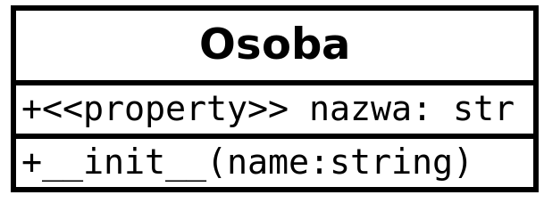

# Programowanie obiektowe w Python - zajęcia 6

**Rozwiązanie zadania 27 z poprzednich zajęć**

Dana jest funkcja wyświetlająca powitanie.<br>
a) Stwórz dekorator `@do_tablicy` zamieniający rezultat tej funkcji na tablicę, np.: `['W','i','t','a','j', ' ','A','l','a']`<br>
b) Stwórz dekorator `@powiekszone` zamieniający rezultat tej funkcji na kapitaliki. np.: `'WITAJ ALA'`<br>
c) Połącz stworzone dekoratory w łańcuch.<br>

```python
def powitanie(imie):
    return f"Witaj {imie}"
```
**Rozwiązanie**

```python
def do_tablicy(func):
    def zamien(*args, **kwargs):
        result=func(*args, **kwargs)
        return list(result)
    return zamien

def powiekszone(func):
    def powieksz(*args, **kwargs):
        result=func(*args, **kwargs)
        return result.upper()
    return powieksz

@do_tablicy
@powiekszone
def powitanie(imie):
    return f"Witaj {imie}"
```

### Dekoratory definiowane jako klasy ###

Jak można było zauważyć do tej pory, definiowanie dekoratorów oparte było na wykorzystaniu zagnieżdżonych funkcji. Jeżeli stworzymy dekorator jako klasę, wtedy zamiast zagnieżdżonych funkcji będziemy mogli wykorzystać metody, co będzie znacznie czytelniejsze. Ponadto klasy mają jeszcze jedną cechę, z której warto skorzystać, mianowicie - omawiane już wcześniej funkcje specjalne. Do definiowania dekoratorów używa się metod `__init__` oraz `__call__`.<br>
Przypomnijmy: `__init__` wywoływana jest tylko raz, podczas inicjalizacji (tworzenia) obiektu. `__call__` wywoływana jest zawsze, gdy wywołujemy utworzony obiekt.

**Przykład**

```Python
class Klasa:
    def __init__(self):
        print("Wywołanie __init__")
    def __call__(self):
        print("Wywołanie __call__")
```

**Zadanie 28**

Wykorzystanie metody specjalnej `__call__`<br>
Uzupełnij podany kod klasy Arytmetyka tak, aby działanie było wybierane na podstawie podanego parametru wywołania. np. obiekt('dodawanie') wykona dodawanie na wartośćiach pól `_a` i `_b` instancji obiektu.

```python
#dany kod:
class Arytmetyka:
    def __init__(self,a,b):
        self._a=a
        self._b=b
    def dodaj(self):
        #...
    def odejmij(self):
        #...        
    def __call__(self):
        wynik=0
        if dzialanie=='dodaj':
            #...
        if dzialanie=='odejmij':
            #...            
        return wynik

#przypadek użycia
obiekt = Arytmetyka(12,23) #wywoła init
obiekt('dodaj')       #wywoła call
```

Mając powyższe na uwadze, stwórzmy dekorator oparty o metody specjalne.<br>

**Przykład**

Dekorator zdefiniowany jako klasa z wykorzystaniem metod `__init__` i `__call__`.

```python
class zwieksz_10_razy:
    def __init__(self,funkcja):
        self.funkcja=funkcja
    def __call__(self,*args,**kwargs):
        result = self.funkcja(*args,**kwargs)
        return result*10

@zwieksz_10_razy
def suma(a,b):
    return a+b 
```

**Zadanie 29**

W zadaniu 27 stworzyliśmy dekoratory definiując je w oparciu o funkcje. Zamień je na klasy. Wzoruj się na ostatnim przykładzie.

**Zadanie 30**

Dany jest dekorator mierzący czas wykonania funkcji. Należy przerobić go na wersję obiektową.

```python
# dekorator do mierzenia czasu wykonania dowolnej funkcji
def czas_wykonania(func):
    def inner1(*args, **kwargs): 
        # zapis czasu przed wykonaniem
        begin = time.time()

        func(*args, **kwargs)
 
        # zapis czasu po wykonaniu
        end = time.time()
        print(f"Czas wykonania funkcji {func.__name__}(): ", end - begin)
 
    return inner1
 
 
# ten dekorator można dodać do dowolnej funkcji
# w tym wypadku funkcja liczy silnię
@czas_wykonania
def silnia(num):
    # uśpienie na 2 sekundy, aby w tym przypadku zarejestrować dłuższy czas
    time.sleep(2)
    print(math.factorial(num))
```

### Dekorator @property ###

W poprzedniej części zajęć poznaliśmy  deskryptory, które tworzyliśmy aby zarządzać atrybutami różnych klas. Przypomnę, że deskryptory są odpowiednikiem tzw. "getters" i "setters", czyli metod dostępowych stosowanych w językach obiektowych, gdzie wykorzystujemy publiczne metody do ustawiania wartości prywatnych atrybutów (jeden z elementów hermetyzacji). Wykorzystują one metody specjalne Pythona: `__get__()`, `__set__()` oraz `__delete__()`. Wiemy też, że do tworzenia deskryptorów możemy użyć funkcji `property()`.<br>
Wspomniane techniki związane są ze specjalnym składnikiem klas stosowanym w niektórych językach programowania, który określamy mianem właściwości klasy (`class property`). Właściwości klas posiadają cechy zarówno pola jak i metody. Są odczytywane i zapisywane jak pola, lecz ich odczyt i zapis przebiega poprzez wywołanie metod. Łatwiej jest odczytywać pola bezpośrednio, jednak odwołując się do nich poprzez metody możemy sprawdzić poprawność danych, czy aktywować kod aktualizacji. Oznacza to, że właściwości (properties) mają cechy pośrednie pomiędzy ciągiem instrukcji (metoda) a danymi (pole) klasy i zapewniają wyższy poziom hermetyzacji niż publiczne pola.<br>
W języku Python właściwości definiuje się z wykorzystaniem wbudowanego dekoratora `@property`.<br>

Przywołajmy przykłady z poprzednich zajęć.

**Przykład**

Deskruptor oparty na metodach specjalnych.

```python
class Descriptor():
    def __get__(self,obj,objtype=None):
        if obj._name=='':
            return "Jestem bezimienny"
        else:    
            return f"Nazywam się: {obj._name}"
    def __set__(self,obj,name):
        if isinstance(name,str):
            obj._name = name
        else:
            raise TypeError("Musisz podać tekst")    
    def __delete__(self,obj):
        obj._name = ''

class Osoba:
    name = Descriptor()
```

**Przykład**

Deskryptor z wykorzystaniem funkcji `property()`

```python
class Osoba:
    def __init__(self,name):
        self._name=name
    def getName(self):
        if self._name=='':
            return "Jestem bezimienny"
        else:    
            return f"Nazywam się: {self._name}"
    def setName(self,name):
        if isinstance(name,str):
            self._name = name
        else:
            raise TypeError("Musisz podać tekst")    
    def delName(self):
        self._name = ''

    name = property(getName, setName, delName, ) 
```

Oba powyższe przykłady, technicznie rzecz biorąc sprowadzają się do utworzenia właściwości klasy.<br>

**Przykład**

Tworzenie właściwości z wykorzystaniem dekoratora `@property`.<br>
Do przedstawienia właściwości na diagramie UML możemy użyć stereotypu `<<property>>`.



```python
class Osoba:
    def __init__(self,name):
        self._name=name

    @property    
    def name(self):
        return self._name

    @name.setter
    def name(self,name):
        if isinstance(name,str):
            self._name = name
        else:
            raise TypeError("Musisz podać tekst")

    @name.getter
    def name(self):
        if self._name=='':
            return "Jestem bezimienny"
        else:    
            return f"Nazywam się: {self._name}"

    @name.deleter
    def name(self):
        self._name=''
```

**Zadanie 31**

Utwórz klasę `Dom`, która posiada właściwość (pole) `cena`. Wykorzystaj dekorator `@property` aby zdefiniować `setter`, `getter` i `deleter` tej właściwości. Wartość ceny powinna być sprawdzana co do poprawności podczas podawania (czy jest liczbą i czy jest większa od 0). Wrtością zwracaną przy pobieraniu ceny powinien być tekst komunikatu: "Cena domu wynosi: XXXX".

**Przykład**

Korzystając z `@property` możemy tworzyć pola "tylko do odczytu" (jest to domyślny sposób działania tego dekoratora).


```python
class Kwadrat:
    def __init__(self,bok,kolor=None):
        self.bok=bok
        self.kolor=kolor
    
    @property
    def pole(self):
        return self.bok**2
```

Zdefiniowaliśmy w klasie Kwadrat pole (w pewnym sensie wirtualne), które jest tylko do odczytu. A co w przypadku, gdy chcemy sprawić, aby istniejące pole instancji - np. `bok` - stało się właściwością tylko do odczytu? Można spróbować tak:

**Przykład**

```python
class Kwadrat:
    def __init__(self,bok,kolor=None):
        self.bok=bok
        self.kolor=kolor
    
    @property
    def pole(self):
        return self.bok**2

    @property
    def bok(self):
        return self.bok
```

Powyższy kod spowoduje, że nie będziemożna utworzyć obiektu, ponieważ nie można ustawić wartosći pola (atrybutu) bok. Jest ono tylko do odczytu, a nie posiada zdefiniowanego settera. Jedyne wyjście, to przechowanie wartości boku kwadratu w innym polu (dobrym pomysłem jest pole chronione lub prywatne, ale nie musi takie być).

**Przykład**

```python
class Kwadrat:
    def __init__(self,bok,kolor=None):
        self._bok=bok
        self.kolor=kolor
    
    @property
    def pole(self):
        return self.bok**2

    @property
    def bok(self):
        return self._bok
```

Teraz obiekt ma właściwość `bok`, którą można zdefiniować podczas tworzenia instancji, lecz jej wartość pozostaje tylko do odczytu przez cały cykl zycia obiektu.

**Zadanie 32**

Wykorzystując klasę `Dom` z zadania 31 stwórz właściwość `własciciel`, której wartość będzie można podać, jednak pozostanie tylko do odczytu.

## Klasa abstrakcyjna ##

Klasa abstrakcyjna może być rozumiana jako schemat do tworzenia innych klas. Pozwala na zdefiniowanie składników klasy, które powinny znaleźć się w klasach z niej dziedziczących. Klasą abstrakcyną jest taka klasa, która zawiera co najmniej jedną abstrakcyjną metodę. Metoda abstrakcyjna w programowaniu obiektowym, to metoda bez implementacji, lecz mogąca posiadać zdefiniowane parametry. Metoda tego rodzaju podlega mechanizmowi dziedziczenia. <br>
Klasy abstrakcyjne przydatne są w dużych projektach, a także wszędzie tam, gdzie chcemy zapewnić wspólny interfejs dla odmiennych implementacji danego komponentu.<br> 
Metody abstrakcyjne zapewniają polimorfizm (wielopostaciowość) interfejsu w obrębie klas znajdujących się w relacji dziedziczenia.<br>
W Python'ie metody i klasy abstrakcyjne definiuje się z wykorzystaniem  modułu `ABC` (Anstract Base Class), który zapewnia narzędzia niezbędne do ich tworzenia i obsługi.<br>

**Przykład**

Klasa z metodą abstrakcyjną i jej implementacja.


```python
from abc import ABC,abstractmethod

# klasa abstrakcyjna
class Wielobok(ABC):
    # metoda abstrakcyjna
    @abstractmethod
    def ilosc_bokow(self):
        pass
 
class Trojkat(Wielobok):
    # implementacjametody abstrakcyjnej
    def ilosc_bokow(self):
        print("Mam 3 boki")
```

**Przykład**

W analogiczny sposób można zdefiniować abstrakcyjną właściwość.

```python
from abc import ABC,abstractmethod,abstractproperty

# klasa abstrakcyjna
class Wielobok(ABC):
    # właściwość abstrakcyjna
    #można też:
    #@property
    #@abstractmethod
    @abstractproperty
    def kolor(self):
        pass
    
    # metoda abstrakcyjna
    @abstractmethod
    def ilosc_bokow(self):
        pass
    
 class Trojkat(Wielobok):
    # implementacja włąściwości abstrakcyjnej (tylko do odczytu)
    @property
    def kolor(self):
        return "zielony"

    # implementacja metody abstrakcyjnej
    def ilosc_bokow(self):
        print("Mam 3 boki")

```

Klasa abstrakcyjna może zawierać takie same składniki jak klasa skonkretyzowana, czyli metody z implementacją, pola klasy, pola instancji a także metody specjalne. Zostaną one odziedziczone, lecz w tym przypadku nie ma obowiązku ich przesłaniać.

**Przykład**

Klasa abstrakcyjna posiadająca metodę z implementacją metody i polem.

```python
from abc import ABC,abstractmethod,abstractproperty

class Wielobok(ABC):

    nazwa = "Wielobok"

    # właściwość abstrakcyjna
    @abstractproperty
    def kolor(self):
        pass
    
    # metoda abstrakcyjna
    @abstractmethod
    def ilosc_bokow(self):
        pass
    
    # metoda zaimplementowana
    def podaj_nazwe(self):
        return self.nazwa
    
class Trojkat(Wielobok):
    # implementacja właściwości abstrakcyjnej (tylko do odczytu)
    @property
    def kolor(self):
        return "zielony"

    # implementacja metody abstrakcyjnej
    def ilosc_bokow(self):
        print("Mam 3 boki")
```

**Przykład**

Z kolei, chcąc określić metody dostępowe dla abstrakcyjnej właściwości można to zrobić następująco:

```python
class Wielobok(ABC):
    # wlasciwosc abstrakcyjna
    @abstractproperty
    def kolor(self):
        pass

    @kolor.setter
    @abstractmethod
    def kolor(self,kolor):
        pass

    @kolor.getter
    @abstractmethod
    def kolor(self):
        pass
    
    # metoda abstrakcyjna
    @abstractmethod
    def ilosc_bokow(self,rura):
        pass
    
 
class Trojkat(Wielobok):
    _kolor="zielony"
    # implementacjan właściwości abstrakcyjnej
    @property
    def kolor(self):
        return self._kolor

    #@kolor.setter
    def kolor(self,kolor):
        self._kolor=kolor

    #@kolor.getter
    def kolor(self):
        return self._kolor

    # implementacja metody abstrakcyjnej
    def ilosc_bokow(self):
        print("Mam 3 boki")
```

**Do czego przydatne są klasy abstrakcyjne?**

Stosując klasy abstrakcyjne tworzymy szablon dla klas dziedziczących. Dzięki temu:<br>
 `-` unikamy powtarzania kodu,<br>
 `-` zapewniamy spójność implementacji podklas,<br>
 `-` gwarantujemy, że nikt nie zapomni zaimplementować kluczowych metod i właściwości w podklasach.<br>
 
 **Przykład**
 
 Poniżej przykład łączący implementację i metody abstrakcyjne w klasie abstrakcyjnej.
 
 ```python
 from abc import ABC,abstractmethod,abstractproperty
import random
class Bohater(ABC):
    def __init__(self,imie):
        self.imie=imie
        self.bron={'miecz':2,'topór':4,'łuk':3}

    @abstractproperty
    def kraina(self):
        ... #pass
    
    @abstractmethod
    def atak(self):
        ...

    def ustalBron(self):
        typ_broni = random.sample(list(self.bron),1)[0]
        sila_ataku=self.bron[typ_broni]
        return [typ_broni,sila_ataku]

class Elf(Bohater):

    @property
    def kraina(self):
        return "Mroczny las"

    def atak(self):
        [typ_broni,sila_ataku] = self.ustalBron()
        if typ_broni=="łuk":
            sila_ataku*=3
        return {typ_broni:sila_ataku}

class Krasnolud(Bohater):
    @property
    def kraina(self):
        return "Góry smocze"

    def atak(self):
        [typ_broni,sila_ataku] = self.ustalBron()
        if typ_broni=="topór":
            sila_ataku*=2
        smocza_pomoc = random.sample([1,2],1)[0]
        sila_ataku*=smocza_pomoc
        return {typ_broni:sila_ataku}

elf=Elf("Krystian")
krasnolud=Krasnolud("Edgar")
 ```

**Zadanie 33**

Wykorzystując powyższy przykład, utwórz abstrakcyjną właściwość `wytrzymałość`, której wartość można zmieniać (można ją tracić bądź odzyskiwać). Jej startowa wartość jest liczbą całkowitą i wynosi 4 dla każdego bohatera. Maksymalna wartość tej właściwości nie może przekraczać 4, jednak krasnoludy mogą być bardziej wytrzymałe i w ich przypadku ten parametr może osiągać maksymalnie 6.


