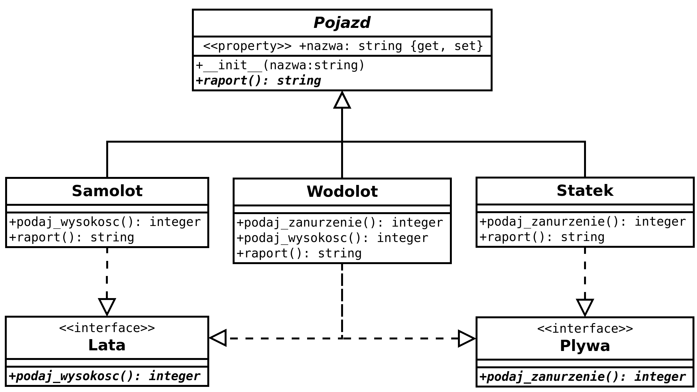

# Programowanie obiektowe w Python - zajęcia 7

**Rozwiązanie zadania 33 z poprzednich zajęć**

Wykorzystując podany wcześniej przykład, należało utworzyć abstrakcyjną właściwość `wytrzymałość`, której wartość można zmieniać (można ją tracić bądź odzyskiwać). Jej startowa wartość jest liczbą całkowitą i wynosi 4 dla każdego bohatera. Maksymalna wartość tej właściwości nie może przekraczać 4, jednak krasnoludy mogą być bardziej wytrzymałe i w ich przypadku ten parametr może osiągać maksymalnie 6.

**Rozwiązanie**

```python
from abc import ABC,abstractmethod,abstractproperty
import random
class Bohater(ABC):
    def __init__(self,imie):
        self.imie=imie
        self.bron={'miecz':2,'topór':4,'łuk':3}
        self._wytrzymalosc = 4

    @abstractproperty
    def wytrzymalosc(self):
        ...

    @wytrzymalosc.setter
    @abstractmethod
    def wytrzymalosc(self):
        ...
    
    @wytrzymalosc.getter
    @abstractmethod
    def wytrzymalosc(self):
        ...

    @abstractproperty
    def kraina(self):
        ... 
    
    @abstractmethod
    def atak(self):
        ...

    def ustalBron(self):
        typ_broni = random.sample(list(self.bron),1)[0]
        sila_ataku=self.bron[typ_broni]
        return [typ_broni,sila_ataku]

class Elf(Bohater):

    @property
    def kraina(self):
        return "Mroczny las"

    @property
    def wytrzymalosc(self):
        return self._wytrzymalosc

    @wytrzymalosc.setter
    def wytrzymalosc(self,wytrzymalosc):
        if wytrzymalosc>4:
            wytrzymalosc=4
        self._wytrzymalosc=wytrzymalosc 
    
    @wytrzymalosc.getter
    def wytrzymalosc(self):
        return self._wytrzymalosc

    def atak(self):
        [typ_broni,sila_ataku] = self.ustalBron()
        if typ_broni=="łuk":
            sila_ataku*=3
        return {typ_broni:sila_ataku}

class Krasnolud(Bohater):
    @property
    def kraina(self):
        return "Góry smocze"

    @property
    def wytrzymalosc(self):
        return self._wytrzymalosc

    @wytrzymalosc.setter
    def wytrzymalosc(self,wytrzymalosc):
        if wytrzymalosc>6:
            wytrzymalosc=6   
        self._wytrzymalosc = wytrzymalosc
    
    @wytrzymalosc.getter
    def wytrzymalosc(self):
        return self._wytrzymalosc

    def atak(self):
        [typ_broni,sila_ataku] = self.ustalBron()
        if typ_broni=="topór":
            sila_ataku*=2
        smocza_pomoc = random.sample([1,2],1)[0]
        sila_ataku*=smocza_pomoc
        return {typ_broni:sila_ataku}

elf=Elf("Krystian")
krasnolud=Krasnolud("Edgar")
```

## Interfejs w programowaniu obiektowym ##

Interfejs w programowaniu obiektowym jest to, według definicji, typ abstrakcyjny, posiadający jedynie operacje i nie posiadający danych. Inaczej mówiąc interfejs zawiera jedynie abstrakcyjne metody. Jeżeli w konkretnej klasie zdefiniowane są wszystkie metody interfejsu, mówimy, że klasa implementuje dany interfejs. Wszystkie metody w interfejsie muszą być publiczne. W programie mogą być tworzone zmienne typu referencja do interfejsu, nie można natomiast tworzyć obiektów tego typu. Referencja może wskazywać na obiekt dowolnej klasy implementującej dany interfejs. Interfejs określa udostępniane operacje, nie zawiera natomiast ich implementacji i danych.<br>
Interfejsy są istotne w językach, które nie umożliwiają wielokrotnego dziedziczenia (z wielu klas jednocześnie) jak np. Java. W Python'ie dziedziczenie wielokrotne jest możliwe, a interfejsy można tworzyć stosując np. odpowiednio zdefiniowane klasy abstrakcyjne. Nie ma jednak żadnej reguły czy instrukcji, która wymuszałaby i regulowała tworzenie interfejsów (np. w Javie tworząc interfejs używa się słowa kluczowego `interface` zamiast `class`, co jednoznacznie wyróżnia definiowaną strukturę). Zatem tworzenie i stosowanie interfejsów w Python'ie jest sprawą umowną i odbywa się jedynie częściowo zgodnie z definicją obowiązującą w teorii programowania obiego.<br>

**Podstawowe różnice między klasą abstrakcyjną a interfejsem:**<br>
`@` Interfejs może zawierać jedynie deklaracje metod, a klasa abstrakcyjna może zawierać również metody zdefiniowane.<br>
`@` Rozszerzając klasę abstrakcyjną klasa może uczestniczyć jedynie w jednej hierarchii, natomiast używając interfejsów klasa może uczestniczyć w wielu typach hierarchii (nie działa w Python'ie).</br>
`@` interfejsy – w przeciwieństwie do klas abstrakcyjnych – wymagają od użytkownika implementacji wszystkich metod w nich zawartych (nie działa w Python'ie). Ponadto Klasy abstrakcyjne mogą ułatwić ten proces, umożliwiając podstawową implementację danej funkcjonalności.</br>
`@` Wszystkie zadeklarowane metody w interfejsie są publiczne, natomiast metody zadeklarowane w klasach mogą być publiczne lub chronione (nie działa w Python'ie).</br>
`@` Klasy abstrakcyjne mogą zawierać atrybuty, natomiast interfejsy – nie.</br>

**Przykład**

Zatem w Python'nie, abstrakcyjna klasa zawierająca tylko abstrakcyjne metody lub właściwości będzie jednocześnie stanowiła interfejs. Jednak nie jest to sformalizowane w składni języka (tak jak i w przypadku abstrakcyjnych klas), ani w module ABC.
```python
from abc import ABC,abstractmethod,abstractproperty
class Bohater(ABC):

    @abstractproperty
    def wytrzymalosc(self):
        ...

    @wytrzymalosc.setter
    @abstractmethod
    def wytrzymalosc(self):
        ...
    
    @wytrzymalosc.getter
    @abstractmethod
    def wytrzymalosc(self):
        ...

    @abstractproperty
    def kraina(self):
        ... 
    
    @abstractmethod
    def atak(self):
        ...
```

**Zadanie 34**

Spróbuj zaimplementować program zgodnie z podanym schematem stosując się do omówionych zasad związanych z definiowaniem klas abstrakcyjnych i interfejsów.



## Moduły ##

Kod żródłowy programu zapisujemy w plikach tekstowych. W przypadku prostych programów wystarczy jeden plik. Programy bardziej złożone mogą być zapisane w wielu plikach. To pozwala rozdzielić części programu i pogrupować poszczególne jego składniki. Odzielone części programu zapisane w plikach nazywamy modułami. Aby można było wykorzystywać je łącznie stosujemy mechanizm importu.

**Przykład**

Najprostszy skrypt w module. Poniższy kod należy zapisać w pliku `moj_modul.py` i zaimportować w innym pliku. Proszę też wykonać plik moj_modul.py z poziomu konsoli.
```python
# moj_modul.py
print("Witaj")

# inny_plik.py
import moj_modul
```

**Przykład**

Funkcja w module.

```python
# moj_modul.py
def suma(a,b):
    print(a+b)
```
Proszę zauważyć, że podczas importu interpretowana jest cała jego zawartość. Oznacza to, że kod wykonywalny (poza funkcją) zostaje wykonany, a w konsoli pojawia się wynik. W przypadku importowania modułu jest to raczej efekt niepożądany, dlatego każdy moduł, jeżeli ma być zarówno wykonywany z zewnątrz jak i importowany, powinien dawać możliwość rozdzielenia tych dwóch przypadków. Można do tego celu użyć wartości zmiennej specjalnej `__name__`, do której Python podstawie nazwę wykonywanego programu (modułu). Jeżeli jest on importowany, to jego nazwa jest taka jak nazwa importowana lub alias, leżeli jest wykonywany z zewnątrz (np. z konsoli) wtedy jego nazwa jest `"__main__"`.

**Przykład**

Implementacja obsługi kontekstu wykonania programu.

```python
def suma(a,b):
    print(a+b)

if __name__=='__main__':
    suma(1,5)
```

**Więcej o importowaniu modułu**

Moduł można zaimportować nie tylko w innym module lecz także bezpośrednio w konsoli. Posłuży wtedy jako źródło funkcji do wykorzystania.

Użycie zaimportowanego modułu.

```python
#Użycie zaimportowanego modułu 
import moj_modul

moj_modul.suma(1,8)

#Dla skrócenia zapisu można użyć aliasu
import moj_modul as mm

mm.suma(1,8)

#Można zaimportować też wybraną funkcję, wtedy zapis będzie jeszcze prostszy

from moj_modul import suma

suma(1,8)
```

**Zadanie 35**

Proszę dodać do modułu `moj_modul.py` funkcję losującą liczbę w zakresie od 1 do 6. <br>
a) zaimportować ją i użyć w module zewnętrznym. <br>
b) przygotować plik `moj_modul.py` tak, żeby podczas wykonania w konsoli pojawiał się komunikat z wynikiem rzutu kostką, np.: "Wynik rzutu kostką: 4" <br>

**Uwaga:** W Visual Studio Code podczas testowania modułu importowanego należy restartować okno interaktywne po każdej zmianie dokonanej w module.

**Przykład**

Moduł w wersji obiektowej.

```python
import random

class Gra:
    def suma(self,a,b):
        print(a+b)

    def rzuc_kostka(self):
        return random.sample(range(1,7),1)[0]

if __name__=='__main__':
    g=Gra()
    print(f"Wynik rzutu kostką: {g.rzuc_kostka()}")
```

**Zadanie 36**

Utworzyć moduły bazując na przykładzie z pojazdami z zadania 34.<br>
a) rozdzielić kod na dwa wzajemnie powiązane moduły: `pojazd_abstrakt.py` zawierający klasy abstrakcyjne i drugi moduł z programem zawierający klasy dla konkretnych pojazdów (Samolot, Statek, Wodolot).<br>
b) umieścić klasy dla konkretnych pojazdów w oddzielnym module 'pojazdy.py' i wywołać go w programie. Proszę pamiętać o powiązaniu go z modułem `pojazd_abstrakt.py`.<br>

## Debugowanie ##

Debugowanie (z ang. debugging) – proces systematycznego redukowania liczby błędów w oprogramowaniu, który zazwyczaj polega na kontrolowanym wykonaniu programu pod nadzorem debuggera.

W trybie debugowania możemy śledzić kolejnośc wykonania i dowiadywać się jaki jest stan zmiennych i obiektów w danym kroku. W tym celu stosuje się punkty przerwań oraz wykonanie krok po kroku.<br>
Oprócz standardowego punktu przerwania, Visual Studio Code daje możliwość definiowania punktów warunkowych (conditional breakpoint):<br>
`-` **Expression** - podajemy warunek dla zmiennej np. zmienna>3 i gdy zmienna spełni warunek nastąpi zatrzymanie wykonania w tym punkcie
`-` **Hit Count** - podajemy liczbę np. 8 - i nastąpi przerwanie, gdy wykonanie przejdzie ósmy raz przez ten punkt - ustawiać we wnętrzu metody
`-` **Log message** - podajemy komunikat - ustswiać na metodzie albo we wnętrzu (w DEBUG CONSOLE widać komunikat i w kółeczku widać liczbę przejść przez ten punkt)

Do kolejnych ćwiczeń proszę wziąć kod z początku zajęć - rozwiązanie zadania 33 (elf/krasnolud).

## Testowanie ##

**Wyrażenie 'assert'**

Asercja (ang. assertion) – predykat (forma zdaniowa w danym języku, która zwraca prawdę lub fałsz), umieszczony w pewnym miejscu w kodzie. Asercja wskazuje, że programista zakłada, iż ów predykat jest w danym miejscu prawdziwy. W przypadku gdy predykat jest fałszywy (czyli niespełnione są warunki postawione przez programistę) asercja powoduje przerwanie wykonania programu. Asercja ma szczególne zastosowanie w trakcie testowania tworzonego oprogramowania, np. dla sprawdzenia luk lub jego odporności na błędy. Zaletą stosowania asercji jest możliwość sprawdzenia, w którym fragmencie kodu źródłowego programu nastąpił błąd.

```python
assert_stmt ::=  "assert" expression ["," expression]
```
Podstawowa forma wyrażenia assert jest równoznaczna z:
```python
if __debug__:
    if not expression: raise AssertionError
```
Rozszerzona forma wyrażenia assert jest równoznaczna z:
```python
if __debug__:
    if not expression1: raise AssertionError(expression2)
```
Assert można stosować w różnych miejscach programu, aby móc upewnić się, że wykonanie przebiega bezbłędnie. W przypadku błędnego wykonania program automatycznie przerwie pracę w oznaczonym miejscu, dzięki czemu będzie je można łatwo zidentyfikować i poprawić błąd.

**Przykład**

```python
x=2
y=30
assert x>y, "lewa strona nie jest większa od prawej"
print("koniec")
```

**Co zazwyczaj podlega testowaniu?**

Sprawdzamy, czy poprawne dane dają poprawny wynik, lub czy niepoprawne dane dają oczekiwany (np. niepoprawny wynik) lub wyjątek.

**Przykład**

Przypuśćmy, że chcemy przetestować, czy funkcja dostaje właściwe wartośći na wejściu.
```python
def dodaj(x, y):
    assert type(x) == int
    assert type(y) == str, f"y jest typu {type(y)}!, powinno być 'str'"
    return x + int(y)
```

Należy pamiętać, że:<br>
- Asercje spowalniają działanie programu.<br>
- Asercje są sprawdzane w zależności od zmiennej logicznej `__debug__`<br>
- Domyślna wartość `__debug__` : `True`<br>
- Zmiennej `__debug__` nie można modyfikować w czasie wykonywania programu<br>
- W przypadku uruchomienia programu z opcją `-O` (optymalizacja) wartością `__debug__` jest `False`.<br>

Do testowania często używa się tzw. framework'ów. Służą one do budowania aplikacji testujących program w sposób autmatyczny. W Python'ie jest ich wiele i można tu wymienić chociażby:
- Robot Framework
- Pytest
- TestProject
- Nose2
- Behave
- Lettuce
- Testify

Każdy z nich ma inną składnię (inny zestaw funkcji/metod/klas do definiowania i automatyzacji testów).

## Testowanie w Visual Studio Code ##

**Przykład**

```python
# modul_do_testowania.py
#Moduł do testowania
def zwieksz(x):
    return x + 1

def zmniejsz(x):
    return x - 1

#plik test_modul_do_testowania.py
import modul_do_testowania as mdt    # Kod do testowania

#funkcje testujące
def test_zwieksz():
    assert mdt.zwieksz(3) == 4

def test_zmniejsz():
    assert mdt.zmniejsz(3) == 4
```

**Przykład**

Testowanie gdy kod testu jest obiektowy.

```python
import modul_do_testowania as mdt    # Kod do testowania

class TestClass: #musi być taka nazwa, żeby pytest ją wychwycił
    #metody testujące
    def test_zwieksz():
        assert mdt.zwieksz(3) == 4

    def test_zmniejsz():
        assert mdt.zmniejsz(3) == 4
```

**Zadanie 37**

Napisać test poprawności wartości zwracanych przez metody klasy `Wodolot` z modułu `pojazdy.py` utworzonego w zadaniu 36.(b)

**Rozwiązanie**

```python
# test_pojazdy.py
from pojazdy import *

def test_wodolot():
    w=Wodolot("Fox 3")
    assert isinstance(w.podaj_wysokosc(), int), "Nie jest 'int'"
    assert isinstance(w.podaj_zanurzenie(), int), "Nie jest 'int'"
    assert isinstance(w.raport(), str), "Nie jest 'str'"
```

**Zadanie 38**

Proszę napisać testy poprawności wartości dla klas `Samolot` i `Statek`

**Zadanie 39 - uzupełnij kod**

Testowanie modulu elf_krasnolud.py (trzeba go utworzyć z rozwiązania zadania 33).

```python
from elf_krasnolud import *

elf=...
wartosci_testowe = [0,1,2,3,4,5,6,-1]

def test_elf_wytrzymalosc():
    for w in wartosci_testowe:
        elf.wytrzymalosc=....
        .... , f"Wytrzymałość={elf.wytrzymalosc}. Wytrzymałość elfa nie może być mniejsza od 0"
        .... , f"Wytrzymałość={elf.wytrzymalosc}. Wytrzymałość elfa nie może być większa od 4"
```

**Rozwiązanie**
```python
from elf_krasnolud import *

elf=Elf("Janusz")
wartosci_testowe = [0,1,2,3,4,5,6,-1]

def test_elf_wytrzymalosc():
    for w in wartosci_testowe:
        elf.wytrzymalosc=w
        assert elf.wytrzymalosc >= 0, f"Wytrzymałość={elf.wytrzymalosc}. Wytrzymałość elfa nie może być mniejsza od 0"
        assert elf.wytrzymalosc <= 4, f"Wytrzymałość={elf.wytrzymalosc}. Wytrzymałość elfa nie może być większa od 4"
```

**Zadanie 40**

a) Proszę dodać test parametru wytrzymałości krasnoluda.<br>
b) Według założeń gry o elfach i krasnoludach siła ataku bohatera nie może przekraczać wartośći 10. Proszę napisać test, który sprawdzi, czy założenie jest spełnione (bez ingerowania w testowany kod poszczególnych klas).<br>

**Rozwiązanie (b)**
```python
def test_elf_atak():
    for licz in range(100):
        a=elf.atak()
        a=list(a.values())[0]
        assert a<=10, f"Atak ={a}. Atak nie może być większy od 10."

def test_krasnolud_atak():
    for licz in range(100):
        a=kr.atak()
        a=list(a.values())[0]
        assert a<=10, f"Atak={a}. Atak nie może być większy od 10."
```


